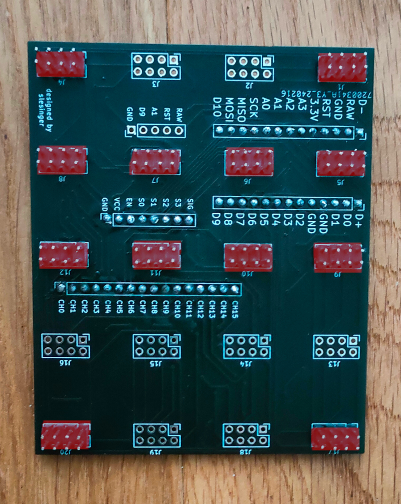
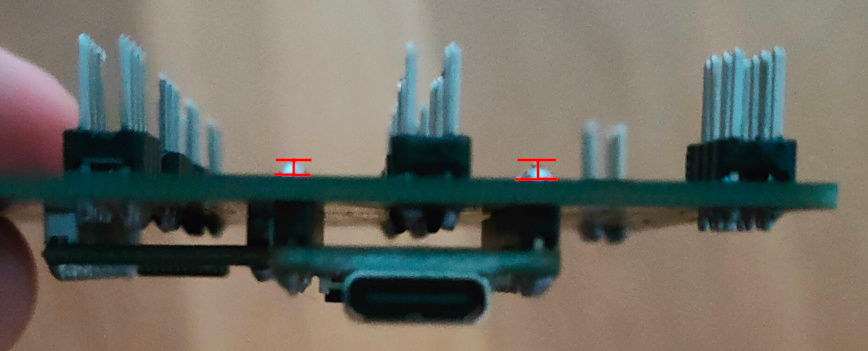

# AdaptBoard keypad

Custom macropad with swappable modules, based on Key Boar 2040.

## Features

- swappable modules
- 4x5 grid
- serial communication

#### Different modules
- key switch module
- potentiometer module
- slide potentiometer module
- lcd module
- joystick module


## Parts list

#### Base of the keypad
- [Kee Boar 2040](https://www.adafruit.com/product/5302)
- [Analog multiplexer](https://www.laskakit.cz/analogovy-multiplexer-16-kanalu-cd74hc4067/)
- custom [PCB](./pcb/)
- mechanical keyboard switches
- 3D printed case
- [pin header](https://www.laskakit.cz/dupont-2x40pin-2-54-mm-pinovy-pas/)*
- [pin header](https://www.laskakit.cz/dupont-40pin-2-54-mm-pinovy-pas/)* for KB2040 and Analog multiplexer
- any USB-C cable

#### Modules
- [potenciometr](https://www.laskakit.cz/psotenciometr-posuvny-10kohm--modul/)*
- [linear potenciometr](https://www.laskakit.cz/potenciometr-rk097n-3-10k-linearni-10k--/)*
- [analog multiplexer](https://www.laskakit.cz/analogovy-multiplexer-16-kanalu-cd74hc4067/)*
- [joystick](https://www.laskakit.cz/joystick-2d-modul/)*
- [OLED display](https://www.laskakit.cz/oled-displej-modry-128x32-0-91--i2c/?gad_source=1&gclid=Cj0KCQiA84CvBhCaARIsAMkAvkJ4arz2CuIuH9ewTWeozkwsCQH9d-Wme8BHi-cLq8MTYEL1yehATqgaArHrEALw_wcB)*
- [pin socket](https://www.laskakit.cz/dupont-2x20pin-2-54-mm-pinovy-pas--samice/)* 02x04
- 3D printed keycaps

<sub>*link to Czech e-shop. You may by elsewhere, just make sure it is the same part model<sub>

## links

[google drive folder](https://drive.google.com/drive/folders/1B5WahlfOYsu4JCbVDwWN0F7cVlUAn-8o)

[trello](https://trello.com/invite/b/YwTRiuGs/ATTI8b8fdaafa9fa064b24e5904e67b1d3ba91FE0345/studentsk-projekt)

[moodle](https://moodle.ssps.cz/course/view.php?id=1443#section-1)

[dluznicek](https://settleup.app/group/-NeHTvoZh2r6y7cITKMY/join)


## Build your own

for required parts see [Parts list](#parts-list)
Once you have all the parts, you can start building your own AdaptBoard keypad.

#### Soldering

1. Solder pin headers to the Kee Boar 2040 and to he Analog multiplexer
2. Solder pin first batch of headers to the custom PCB

3. Trim the headers on the Kee Boar 2040 and Analog multiplexer, so they are ~1mm above the PCB

Then solder the Kee Boar 2040 and Analog multiplexer to the back side of the PCB
4. Solder the remaining headers to the PCB

#### Assembling

@TODO

#### Programming
1. Install [CircuitPython](https://learn.adafruit.com/adafruit-kb2040/circuitpython) on your Kee Boar 2040
2. Delete the `code.py` file from the CIRCUITPY drive
3. Upload our [firmware](./firmware/) to the CIRCUITPY drive
The final file structure should look like this:
```plaintext
CIRCUITPY
    analog_signal_processor.py
    boot_out.txt #circuitpy system file
    functions.py
    /lib
        /adafruit_display_text
        /adafruit_hid
        adafruit_pixelbuf.mpy
        neopixel.mpy
    main.py
    ssd1306_display.py
```
4. Go to [our App](lukasovaCoolAplikace) and create your own layout and configuration